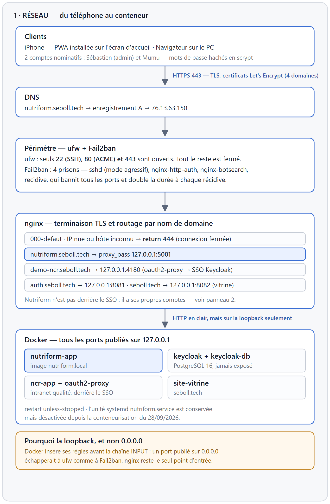
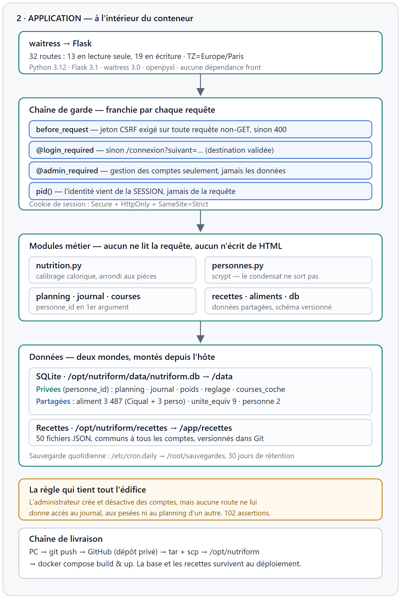
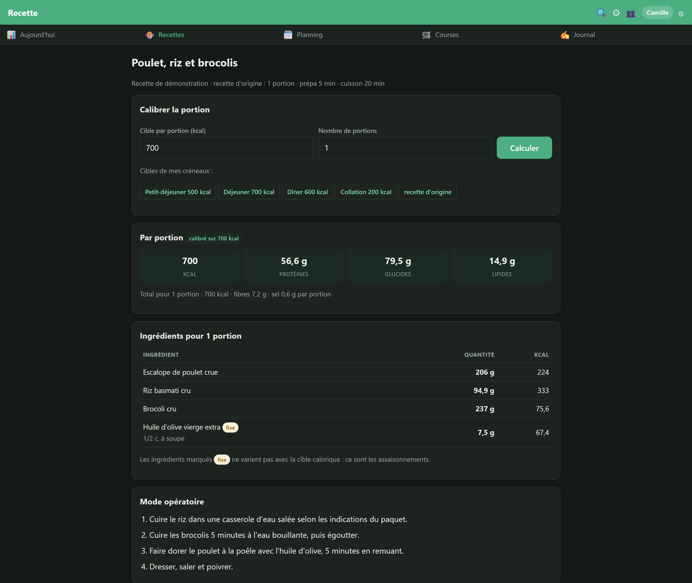
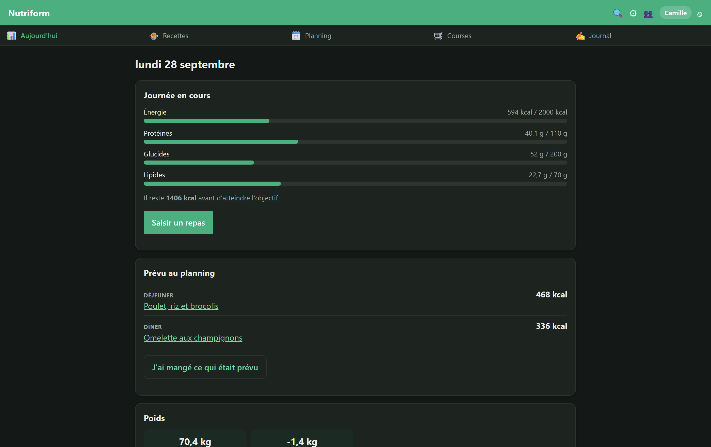
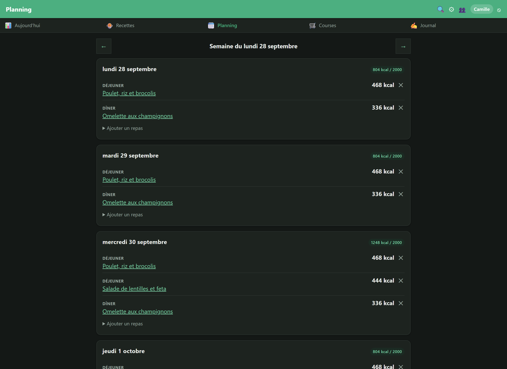
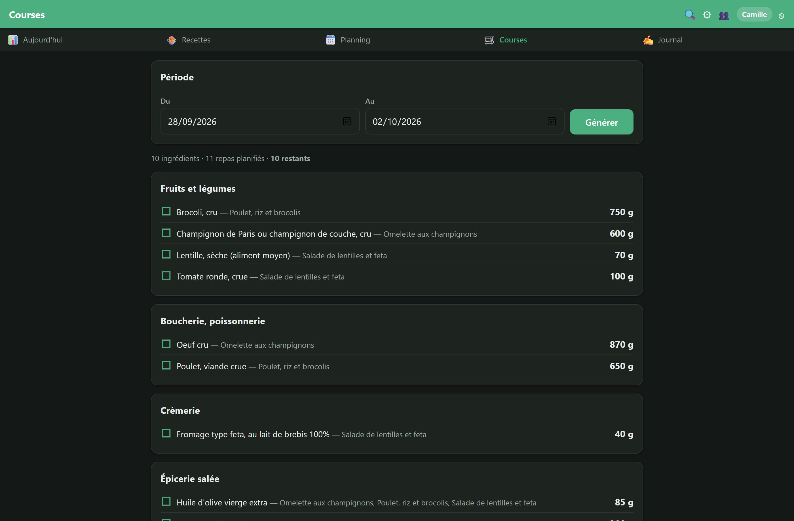
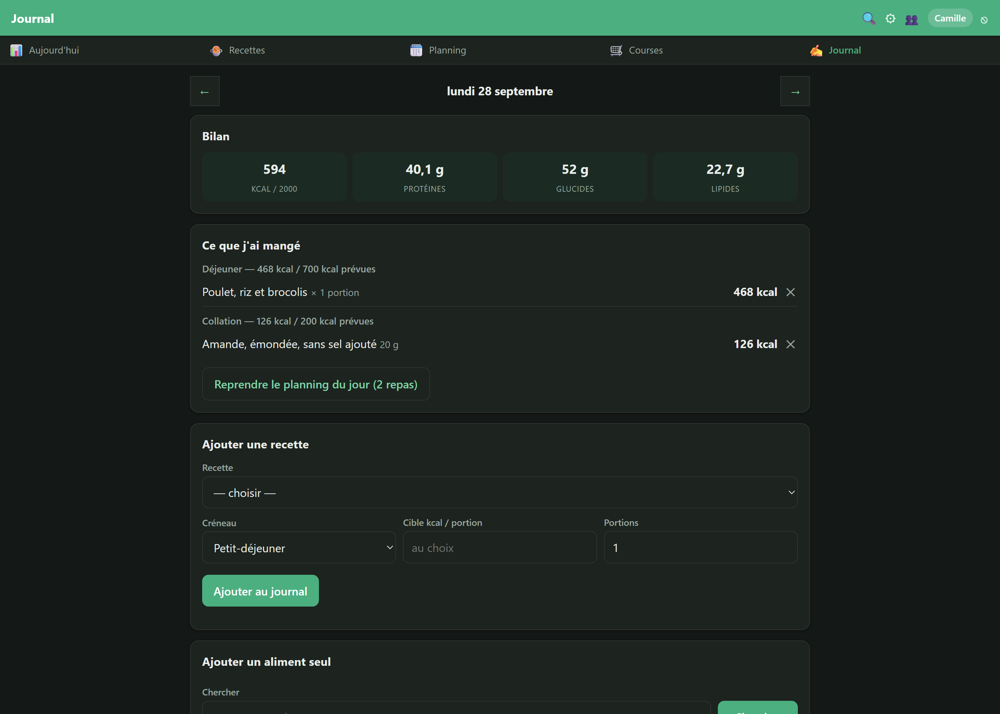

# Étude de cas — Nutriform — un suivi nutritionnel familial, de la recette calibrée au serveur

> **Projet personnel, captures de démonstration.** Nutriform est une application développée pour un usage familial. Les écrans reproduits ici utilisent un **compte fictif** et des **recettes neutres écrites pour l'occasion** : aucune donnée de santé réelle ni aucune recette tierce n'y figure.

---

## Le contexte

Suivre un régime alimentaire suppose de savoir ce que l'on mange, en quelle quantité, et de s'y tenir sur la durée. Le besoin s'est élargi en cours de route : **partager l'outil avec des proches qui ne vivent pas sous le même toit**, donc sans jamais mélanger les données des uns et des autres.

## Le problème

Les applications de suivi existantes butent toutes sur les mêmes limites :

- **Une recette donne une portion, pas la vôtre.** Passer d'une portion à 400 kcal à la même recette à 700 kcal impose de recalculer chaque ingrédient à la main — et de se tromper.
- **Tout ne se divise pas.** Mettre « 1,3 œuf » dans une recette n'a aucun sens, pas plus que 3,4 feuilles de lasagne : un calcul purement proportionnel produit des quantités incuisinables.
- **Les valeurs nutritionnelles divergent.** Une fiche d'application grand public annonçait **0,19 g de sel** pour un plat qui en contient près de **9 g** d'après l'étiquette réelle de la sauce employée — soit près du double de l'apport quotidien recommandé.
- **Partager n'est pas mutualiser.** Des proches peuvent partager des recettes ; leur poids et leur journal alimentaire, non.

## La solution

Une **application web autonome**, installable sur l'écran d'accueil d'un iPhone, hébergée sur un serveur personnel :

- **Calibrage calorique** : la même recette se décline sur n'importe quelle cible. Les assaisonnements sont marqués « fixes » et ne bougent pas ; seuls les ingrédients principaux suivent.
- **Arrondi aux unités indivisibles** : œufs, tranches de pain, feuilles de lasagne sont comptés en pièces entières, et les autres ingrédients se réajustent pour retomber sur la cible.
- **Base officielle** : table Ciqual 2025 de l'ANSES, 3 484 aliments, complétée par des aliments personnels saisis d'après l'étiquette du produit réellement acheté.
- **Planning hebdomadaire, liste de courses** entre deux dates agrégée sur les quantités réellement calibrées, **journal** et courbe de poids.
- **Un compte par personne**, avec un cloisonnement strict : l'administrateur gère les comptes et ne peut lire aucune donnée personnelle.

## L'architecture

L'application est conteneurisée et publiée derrière un serveur web unique. Les deux schémas ci-dessous ont été **relevés sur le serveur**, pas dessinés de mémoire : règles de pare-feu, ports publiés, montages et comptages de tables proviennent d'une inspection de la machine en production.

- **Un seul point d'entrée.** Le pare-feu n'ouvre que SSH, HTTP et HTTPS ; tous les conteneurs publient sur la boucle locale. Un port publié largement échapperait au pare-feu comme au bannisseur d'adresses.
- **L'adresse IP nue ne répond rien** : un hôte inconnu obtient une connexion fermée, sans page ni bannière de version.
- **L'identité vient de la session, jamais de la requête.** C'est la règle qui garantit le cloisonnement, et une suite de tests la vérifie en trichant délibérément sur les identifiants d'URL.
- **Chaîne de garde** : jeton anti-CSRF sur toute écriture, cookie de session chiffré, restreint au domaine et inaccessible au JavaScript.
- **Sauvegarde quotidienne** de la base, avec 30 jours de rétention.

**Le chemin du téléphone au conteneur**
DNS, terminaison TLS, pare-feu et bannissement automatique, routage par nom de domaine, puis les conteneurs — tous publiés sur la boucle locale.

**L'intérieur de l'application**
La chaîne de garde franchie par chaque requête, les modules métier, et la séparation entre données privées et données partagées.

## Le fonctionnement, écran par écran

**Calibrage d'une recette — le cœur de l'outil**
La même recette demandée à 700 kcal : le poulet, le riz et les brocolis sont recalculés, tandis que l'huile d'olive reste figée à 7,5 g parce qu'elle sert à la cuisson. Les macronutriments, les fibres et le sel de la portion sont calculés dans la foulée.

**Aujourd'hui — l'état de la journée en un coup d'œil**
Énergie et macronutriments consommés face aux objectifs personnels, ce qu'il reste à manger, et les repas déjà prévus au planning — reportables au journal en deux clics.

**Planning — sept jours, quatre créneaux**
Chaque repas porte sa cible calorique. Le total du jour se compare à l'objectif, et une journée se duplique d'un clic sur une autre.

**Liste de courses — entre deux dates, regroupée par rayon**
Les ingrédients sont cumulés à partir des quantités réellement calibrées, pas des quantités d'origine. Les cases cochées sont mémorisées : on coche sur le téléphone, c'est à jour sur l'ordinateur.

**Journal et poids — ce qui a réellement été mangé**
Un repas planifié se reporte en deux clics, un aliment seul s'ajoute à la volée. Le suivi du poids et sa courbe complètent la journée. Ces données sont strictement privées.

## Ce que l'application a changé

| Avant | Après |
|---|---|
| Une recette = une seule portion figée | La même recette servie à 400, 600 ou 700 kcal |
| Quantités recalculées à la main, au risque de l'erreur | Recalcul instantané, assaisonnements figés, pièces arrondies |
| Valeurs nutritionnelles reprises telles quelles | Table officielle de l'ANSES, et l'étiquette du produit quand elle diffère |
| Liste de courses reconstituée de mémoire | Agrégée entre deux dates, regroupée par rayon, cochable |
| Outil mono-utilisateur | Un compte par personne, données personnelles cloisonnées |

Le bénéfice s'est surtout révélé sur la **fiabilité des chiffres**. Le recoupement systématique des 33 recettes transcrites avec les valeurs annoncées par leur source a fait apparaître des écarts que le calcul explique : sauces sucrées trois fois plus caloriques que l'équivalent générique, teneurs en sel sous-estimées d'un facteur vingt, sous-totaux incohérents entre le sel et le sodium d'une même fiche.

> **Transparence** : projet personnel, sans client ni mission facturée — aucun gain en heures n'est avancé ici. Les écarts nutritionnels cités sont reproductibles : ils proviennent du calcul sur la table Ciqual 2025 et des étiquettes des produits effectivement utilisés.

## Pour aller plus loin

- **Stack** : Python · Flask · SQLite · waitress — aucune dépendance front, aucun framework JavaScript.
- **Exploitation** : conteneur Docker derrière nginx, TLS Let's Encrypt, pare-feu et bannissement automatique des adresses hostiles, sauvegarde quotidienne.
- **Qualité** : 394 assertions réparties en 7 suites autonomes, dont une consacrée au seul cloisonnement entre comptes et une autre à la migration de schéma sans perte de données.
- **Sécurité** : analyse statique du code à chaque évolution ; une redirection ouverte et l'absence de protection anti-CSRF ont été détectées puis corrigées.
- **Site & contact** : seboll.tech — démonstration et détails techniques sur demande.

*Conçu par Sébastien Ollagnier — ingénieur qualité & industrialisation, spécialisé dans la digitalisation et l'automatisation des processus.*

---
---

## ✍️ Note interne (à supprimer avant publication)

Projet PERSONNEL, pas une mission client : ne jamais le présenter comme une réalisation facturée. Les captures utilisent un compte fictif (« Camille ») et trois recettes neutres écrites pour l'occasion — le dépôt réel est privé parce qu'il contient des recettes appartenant à leur éditeur, qui ne doivent pas être publiées. Le schéma d'architecture est régénéré depuis deploy/architecture.svg : après un changement d'infrastructure, refaire le relevé sur le serveur avant de le réutiliser.
