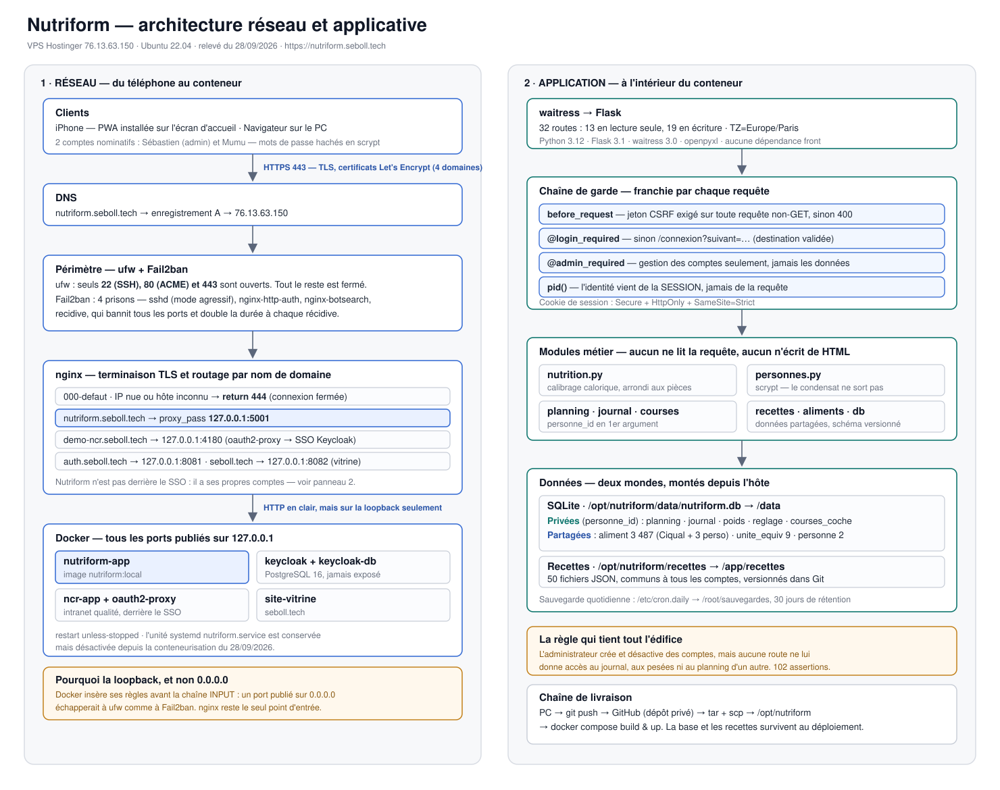

# Architecture

Schéma relevé sur le serveur le 28/09/2026, pas dessiné de mémoire : vhosts,
règles ufw, prisons Fail2ban, ports publiés, montages Docker et comptages de
tables viennent tous d'une inspection du VPS et de la base de production.

## Les quatre choses à retenir

**Un seul point d'entrée.** ufw n'ouvre que 22, 80 et 443. Tous les conteneurs
publient sur `127.0.0.1`, jamais sur `0.0.0.0` — Docker insère ses règles avant
la chaîne `INPUT`, un port publié largement échapperait donc à ufw *et* à
Fail2ban. nginx est le seul à écouter sur l'extérieur.

**L'IP nue ne répond rien.** Le vhost `000-defaut` renvoie `return 444` sur 80
et 443 : un scanner qui frappe `https://76.13.63.150` n'obtient ni page, ni
en-tête, ni bannière de version.

**Nutriform n'est pas derrière le SSO Keycloak**, contrairement à
`demo-ncr.seboll.tech`. C'est délibéré : l'application a ses propres comptes et
un cloisonnement strict par `personne_id`. L'y brancher serait un chantier
applicatif, pas un ajout nginx.

**L'identité vient de la session, jamais de la requête.** C'est la règle qui
tient tout l'édifice côté application, et `tests/test_cloisonnement.py` la
vérifie en trichant délibérément sur les identifiants d'URL.

## Ce que le schéma ne dit pas

Le déploiement décrit en bas à droite passe encore par `installer-vps.sh`, écrit
pour systemd. Depuis la conteneurisation du 28/09/2026, l'unité est désactivée
et le script ne sait pas reconstruire l'image : voir la note de `DEPLOY.md`.

Pour régénérer le schéma après un changement d'infrastructure, refaire le relevé
sur le serveur — le SVG est écrit à la main, il ne se génère pas tout seul.
